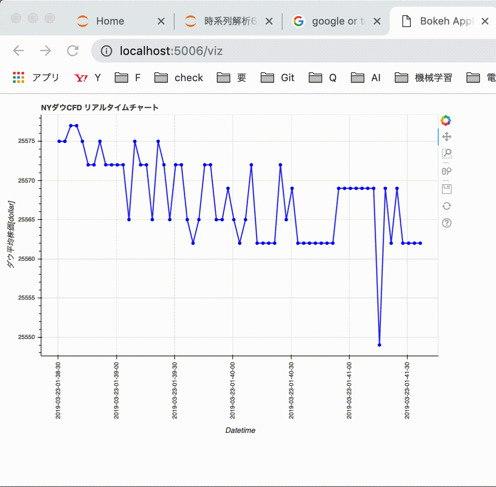
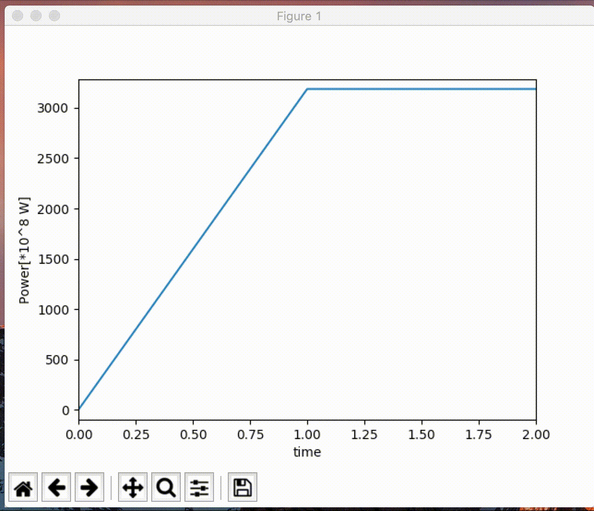

# real_time_viz

## Chartjs (javascript)
https://nagix.github.io/chartjs-plugin-streaming/samples/

## Bokeh (python)
こちらの内容です  
https://blog.tsurubee.tech/entry/2017/11/11/160012 
https://bokeh.pydata.org/en/latest/docs/installation.html

## matplot (python)
こちらの内容です  
https://org-technology.com/posts/matplotlib-realtime-plot.html

